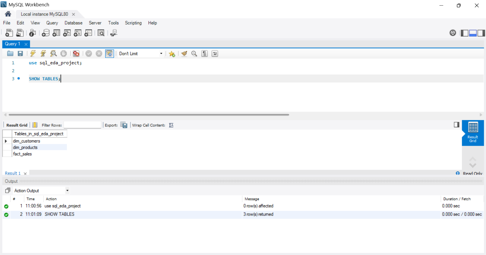

# SQL Business Analytics & Exploratory Data Analysis

## 📌 Project Overview

This project performs Exploratory Data Analysis (EDA) on a retail
sales database using MySQL.

The objective is to explore customer, product, and sales data,
identify patterns, measure business performance, and generate
meaningful business insights using SQL.

The analysis is performed using three main tables:

- `dim_customers`
- `dim_products`
- `fact_sales`

---

## 🎯 Business Objectives

The main objectives of this project are:

- Explore the structure of the sales database
- Understand customer demographics
- Analyze product categories and subcategories
- Analyze sales performance over time
- Calculate important business metrics
- Identify top-performing products
- Identify high-value customers
- Analyze revenue distribution
- Segment customers based on sales
- Analyze year-over-year sales performance
- Generate meaningful business insights

---

## 🗂️ Dataset

The project contains three main tables.

### 1. `dim_customers`

Contains customer-related information such as:

- Customer key
- First name
- Last name
- Country
- Gender
- Marital status

### 2. `dim_products`

Contains product-related information such as:

- Product key
- Product name
- Category
- Subcategory
- Cost

### 3. `fact_sales`

Contains transactional sales information such as:

- Order number
- Order date
- Customer key
- Product key
- Quantity
- Sales amount

---

## 🛠️ Technologies Used

- MySQL
- MySQL Workbench
- SQL

---

## 🔍 Analysis Performed

### 1. Database Exploration

The database exploration phase includes:

- Viewing available database tables
- Inspecting table structures
- Examining sample records
- Calculating customer count
- Calculating product count
- Calculating sales record count

---

### 2. Dimensions Exploration

Customer and product dimensions are analyzed using:

#### Customer Analysis

- Customer countries
- Gender distribution
- Marital status distribution
- Customer count by country
- Customer count by gender
- Customer count by marital status

#### Product Analysis

- Product categories
- Product subcategories
- Product hierarchy
- Number of products in each category

---

### 3. Date Exploration

Sales data is analyzed over time using:

- Earliest order date
- Latest order date
- Orders by year
- Sales by year
- Sales by month
- Orders by month
- Sales by year and month name

This helps understand changes in sales and order activity over time.

---

### 4. Measures Exploration

Important business metrics are calculated, including:

- Total sales
- Total quantity
- Average sales
- Minimum sale
- Maximum sale
- Total orders
- Total customers
- Total products
- Average price

A combined query is also used to generate an overall summary of
important sales metrics.

---

### 5. Magnitude Analysis

Magnitude analysis examines business performance across different
dimensions.

The analysis includes:

- Customers by country
- Customers by gender
- Products by category
- Average product cost by category
- Revenue by product category
- Items sold by country
- Revenue by product subcategory
- Revenue by customer

---

### 6. Ranking Analysis

Ranking analysis identifies high- and low-performing products and
customers.

The analysis includes:

- Top 5 products by revenue
- Bottom 5 products by revenue
- Top 10 customers by revenue
- Customer order activity
- Revenue by category
- Product ranking using the `RANK()` window function

---

### 7. Advanced Analysis

Advanced SQL techniques are used to perform deeper business analysis.

The analysis includes:

#### Customer Sales Analysis

- Calculate total sales for each customer
- Rank customers based on sales performance

#### Customer Segmentation

Customers are segmented into groups based on their total sales using
a `CASE` expression.

Example segments include:

- High Value
- Medium Value
- Low Value

#### Customer Segment Analysis

The project analyzes:

- Number of customers in each segment
- Revenue generated by each segment
- Average customer revenue within each segment

#### Category Revenue Contribution

The percentage contribution of each product category to total sales
is calculated using SQL window functions.

#### Cumulative Sales

Daily sales are analyzed to calculate cumulative sales over time.

#### Monthly Sales Analysis

Sales are aggregated by year and month to examine monthly performance.

#### Year-over-Year Analysis

Yearly sales are compared with the previous year's sales using the
`LAG()` window function.

The analysis calculates:

- Previous year sales
- Sales difference between years

#### Top Product Analysis

Products are ranked based on revenue and the top-performing products
are identified using SQL window functions.

#### Average Order Value

Average order value is calculated using total sales and the number
of distinct orders.

---

## 📚 SQL Concepts Used

This project demonstrates the following SQL concepts:

### Basic SQL

- `SELECT`
- `DISTINCT`
- `ORDER BY`
- `LIMIT`

### Filtering and Grouping

- `WHERE`
- `GROUP BY`

### Aggregate Functions

- `COUNT()`
- `COUNT(DISTINCT)`
- `SUM()`
- `AVG()`
- `MIN()`
- `MAX()`

### Joins

- `INNER JOIN`
- `LEFT JOIN`

### Date Functions

- `YEAR()`
- `MONTH()`
- `MONTHNAME()`

### Conditional Logic

- `CASE`

### Common Table Expressions

- `WITH`
- CTE-based analysis

### Window Functions

- `RANK()`
- `ROW_NUMBER()`
- `LAG()`
- Window-based cumulative calculations
- Percentage contribution using window functions

---

## 🗄️ Database Structure

The project follows a simple dimensional structure:

````text
                 ┌──────────────────┐
                 │  dim_customers   │
                 │──────────────────│
                 │ customer_key     │
                 │ first_name       │
                 │ last_name        │
                 │ country          │
                 │ gender           │
                 │ marital_status   │
                 └────────┬─────────┘
                          │
                          │ customer_key
                          ▼
                 ┌──────────────────┐
                 │   fact_sales     │
                 │──────────────────│
                 │ order_number     │
                 │ order_date       │
                 │ customer_key     │
                 │ product_key      │
                 │ quantity         │
                 │ sales_amount     │
                 └────────┬─────────┘
                          │
                          │ product_key
                          ▼
                 ┌──────────────────┐
                 │  dim_products    │
                 │──────────────────│
                 │ product_key      │
                 │ product_name     │
                 │ category         │
                 │ subcategory      │
                 │ cost             │
                 └──────────────────┘
````

## 💡 Analysis Summary

### Database Exploration

- Explored the structure of the `dim_customers`, `dim_products`, and
  `fact_sales` tables.
- Examined sample records from all three tables.
- Calculated the total number of customers, products, and sales records.

### Dimensions Exploration

- Identified distinct customer countries and gender categories.
- Identified product categories and subcategories.
- Explored the product hierarchy using category, subcategory, and product name.
- Analyzed product count by category.
- Analyzed customer distribution by country.
- Analyzed customer distribution by gender.
- Analyzed customer distribution by marital status.

### Date Exploration

- Identified the earliest and latest order dates.
- Analyzed orders by year.
- Analyzed sales by year.
- Analyzed sales by month.
- Analyzed orders by month.
- Analyzed sales using year and month names.

### Measures Exploration

- Calculated total sales revenue.
- Calculated minimum and maximum sales amounts.
- Calculated total quantity sold.
- Calculated total orders.
- Calculated total products and customers.
- Calculated average price.
- Created a combined summary of major business metrics.

### Magnitude Analysis

- Analyzed customer distribution by country.
- Analyzed customer distribution by gender.
- Analyzed product distribution by category.
- Calculated average product cost by category.
- Analyzed revenue by product category.
- Analyzed items sold by country.
- Analyzed revenue by product subcategory.
- Analyzed revenue generated by individual customers.

### Ranking Analysis

- Identified the top 5 products by revenue.
- Identified the bottom 5 products by revenue.
- Identified the top 10 customers by revenue.
- Analyzed customer order activity.
- Ranked product categories by revenue.
- Ranked products using the `RANK()` window function.

### Advanced Analysis

- Calculated customer-level sales using CTEs.
- Segmented customers based on total sales.
- Analyzed revenue by customer segment.
- Calculated average revenue by customer segment.
- Calculated category percentage contribution to total revenue.
- Calculated cumulative sales over time.
- Analyzed monthly sales performance.
- Compared yearly sales with previous years.
- Calculated year-over-year sales differences.
- Ranked top products using window functions.
- Calculated average order value.

## 📊 Key Business Insights

The analysis performed on the sales dataset provided the following
business insights:

- Sales performance was analyzed across different years and months
  to understand changes in revenue and order activity.

- Customer distribution was analyzed across different countries,
  genders, and marital statuses.

- Product categories and subcategories were compared based on
  product count, average cost, and revenue.

- Product-level revenue analysis was used to identify the
  top-performing and bottom-performing products.

- Customer-level revenue analysis was used to identify
  high-revenue customers.

- Customer segmentation was performed based on total sales to
  compare different customer groups.

- Category revenue contribution was analyzed to understand the
  percentage of total revenue generated by each category.

- Year-over-year analysis was performed to compare sales performance
  between consecutive years.

- Average order value was calculated to understand the average
  revenue generated per order.


  ## 📁 Project Structure

```text
SQL-EDA-Business-Analysis/
│
├── dataset/
│   ├── dim_customers.csv
│   ├── dim_products.csv
│   └── fact_sales.csv
│
├── sql/
│   ├── database_exploration.sql
│   ├── dimensions_exploration.sql
│   ├── date_exploration.sql
│   ├── measures_exploration.sql
│   ├── magnitude_analysis.sql
│   ├── ranking_analysis.sql
│   └── advanced_analysis.sql
│
├── screenshots/
│
├── docs/
│   └── analysis_notes.md
│
├── README.md
└── .gitignore
```

## ▶️ How to Run

### 1. Install MySQL

Install the following:

- MySQL Server
- MySQL Workbench

### 2. Create the Database

Open MySQL Workbench and execute:

```sql
CREATE DATABASE sql_eda_project;
```

### 3. Select the Database
```
USE sql_eda_project;
```
### 4. Import the Dataset

Import the following CSV files into MySQL:
```
dim_customers.csv
dim_products.csv
fact_sales.csv
```
Create the corresponding tables:
```
dim_customers
dim_products
fact_sales
```

### 5. Run the SQL Analysis

Open the SQL files from the sql folder in MySQL Workbench.

Execute them in the following order:

1. database_exploration.sql
2. dimensions_exploration.sql
3. date_exploration.sql
4. measures_exploration.sql
5. magnitude_analysis.sql
6. ranking_analysis.sql
7. advanced_analysis.sql

Each SQL file focuses on a different stage of the business analysis.

### 6. Explore the Results

Execute the queries in MySQL Workbench and analyze the result sets to understand:

Customer demographics
Product categories and subcategories
Sales trends over time
Revenue performance
Top and bottom performing products
High-value customers
Customer segments
Category revenue contribution
Year-over-year sales performance


## 📸 Screenshots

The project includes screenshots of important SQL queries and their
corresponding results from MySQL Workbench.

### Database Exploration



### Overall Business Measures


### Sales by Category


### Sales by Country


### Top 10 Customers


### Top 10 Products


## 📈 Future Improvements

The project can be further extended with the following improvements:

- Build an interactive Power BI dashboard for visualizing business insights.
- Add profit and profit-margin analysis.
- Perform deeper customer segmentation.
- Analyze repeat customer behavior.
- Calculate Customer Lifetime Value (CLV).
- Perform customer cohort analysis.
- Add sales forecasting using historical sales data.
- Create interactive business dashboards for decision-making.
- Add more advanced SQL queries for deeper business analysis.

## 🙏 Credits

This project was inspired by the SQL Exploratory Data Analysis
project by Data With Baraa.

The project was independently organized and extended with additional
SQL analysis, business questions, documentation, and insights.

## 👨‍💻 Author

**Spoorthi S V**

B.E. - Artificial Intelligence and Machine Learning

GitHub: [SPOORTHISV6](https://github.com/SPOORTHISV6)
````
